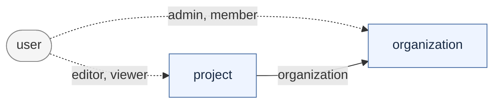
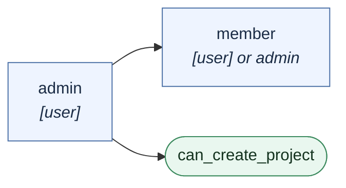
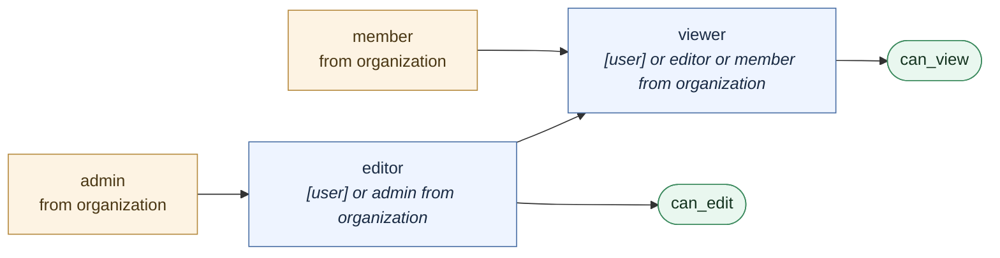
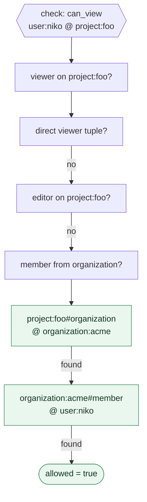
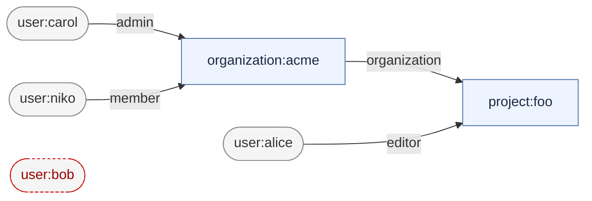

# Visualizing the Model

A visual reference for [`model.fga`](model.fga). The diagrams are Mermaid, so they render
directly on GitHub and in most Markdown viewers.

> These diagrams are maintained by hand and can drift from `model.fga`. The model itself is
> the source of truth; the access matrix at the bottom is verified by `fga model test`.

## Types

Three types, one hierarchy edge. A `project` belongs to an `organization`; a `user` can be
attached to either.



Solid arrow = the hierarchy edge stored as a tuple (`project:foo#organization@organization:acme`).
Dotted arrows = roles a user can be granted directly.

## Relations on `organization`



An admin is automatically a member, so an admin never needs two tuples. Only admins can
create projects.

## Relations on `project`



Read the arrows as "implies". Because `editor → viewer → can_view`, anyone who can edit
can also view, and an organization admin picks up both without a single project-level
tuple.

## How a check resolves

`can_view(user:niko, project:foo)` where niko is only a member of the organization:



The last two steps are why the `organization` tuple matters: without it the project is an
orphan and no organization-derived access reaches it.

## The seeded tuples

What [`tuples/development.yaml`](tuples/development.yaml) actually writes:



Four tuples. `user:bob` has none, and exists in the tests purely as the negative case.

## Effective access

Derived from those tuples and verified with `fga model test`:

| user | role held | `can_view` foo | `can_edit` foo | `can_create_project` acme |
|------|-----------|:---:|:---:|:---:|
| `user:carol` | `admin` on acme | ✅ | ✅ | ✅ |
| `user:alice` | `editor` on foo | ✅ | ✅ | ❌ |
| `user:niko` | `member` on acme | ✅ | ❌ | ❌ |
| `user:bob` | — | ❌ | ❌ | ❌ |

Carol holds one tuple and gets everything: `admin` implies `member`, and `admin from
organization` implies `editor` on every project in the org, which implies `viewer`. Alice
is the opposite shape — full access to one project, no standing in the organization at
all.

## Generating visualizations

**The bundled Playground** is an interactive model explorer, but it is **off by default**
and this repo's `docker-compose.yml` does not publish its port. To use it, add to the
`openfga` service:

```yaml
    environment:
      - OPENFGA_PLAYGROUND_ENABLED=true
    ports:
      - "3000:3000"
```

Then open <http://localhost:3000/playground>.

**Inspect the model as JSON** — the expanded relation tree, useful when a permission does
not resolve the way the diagrams suggest:

```bash
fga model transform --file model.fga > model.json
```

**Explain a single check** against a running store, which is the fastest way to find a
missing tuple:

```bash
fga query check --store-id=$FGA_STORE_ID user:niko can_view project:foo
fga query expand --store-id=$FGA_STORE_ID can_view project:foo
```

`expand` prints the userset tree for one relation on one object — the concrete form of the
"how a check resolves" diagram above.
